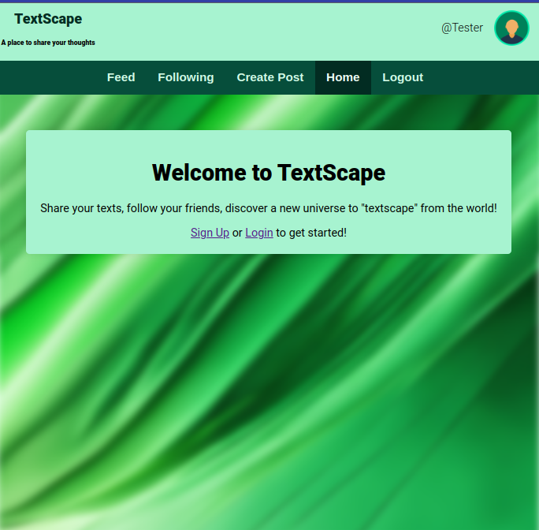
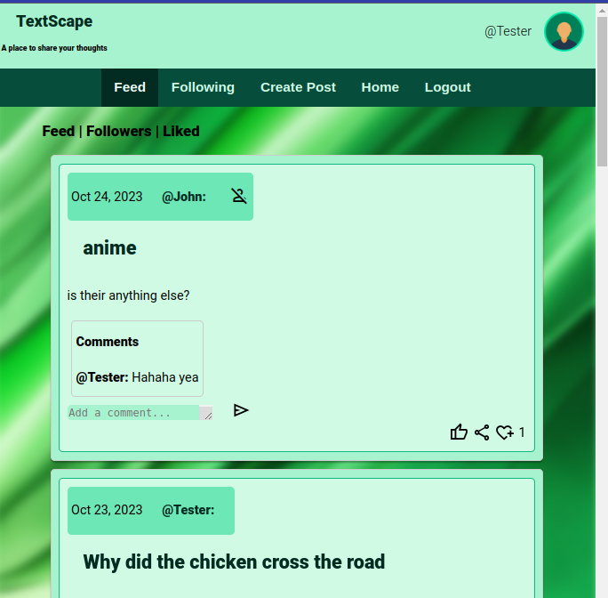
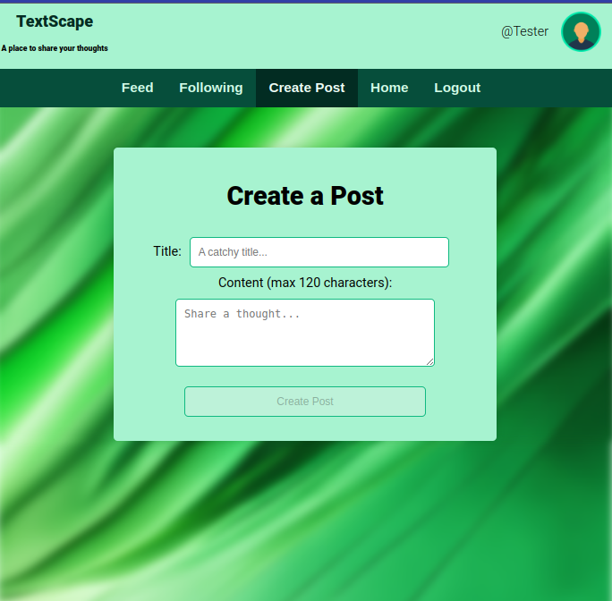
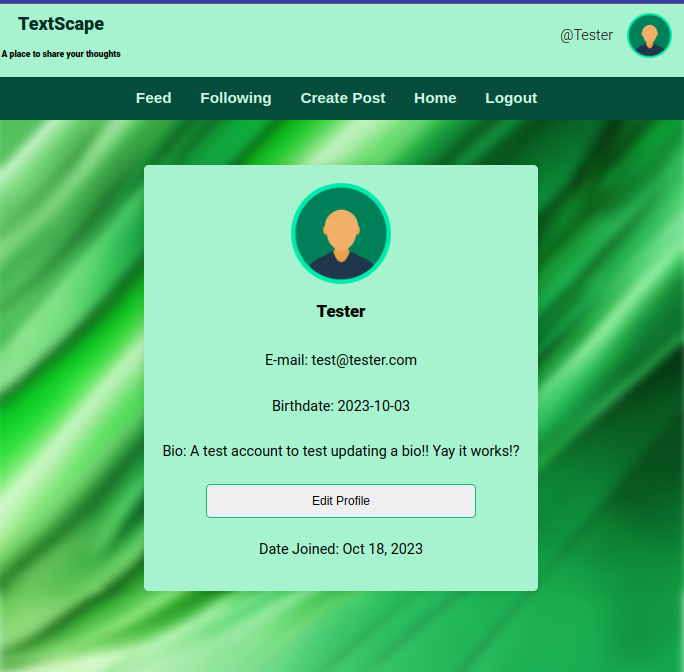

# TextScape

## Angular/Django Social Media App

A social media platform for users to share their thoughts and ideas with the world. Users can create an account, post their thoughts, and interact with other users by liking and commenting on their posts.



## Technologies Used

### Front-End

* Angular
* TypeScript
* HTML
* CSS
* Bootstrap

### Back-End

* Django
* Python
* PostgreSQL

## Features

* **User Authentication**: Secure sign-up and login functionality using Simple JWT.
* **Create Posts**: Users can share their thoughts with ease.
* **User Profiles**: Individualized pages that showcase each user's posts and activities.
* **Follow Mechanism**: Users can follow and unfollow peers.
* **Feed System**: Displays posts from all users.
* **Following Feed**: Showcases posts specifically from users that one follows.
* **Like System**: Users can like and unlike posts.
* **Commenting**: Users can comment on posts.

## Getting Started

1. Clone the repository

    ```bash
    git clone https://github.com/Z8phyR/TextScape.git
    ```

2. Install dependencies for Angular and Django

    ```bash
    cd TextScape
    npm install
    pip install -r requirements.txt
    ```

3. Start the application

    ```bash
    ng serve
    ```

4. Navigate to <http://localhost:4200/> in your browser

## Technical Challenges

* **Adopting TypeScript**: Transitioning and learning a new language added complexity to the development process.
* **Angular's Framework**: Grasping the optimal usage of Angular components, modules, and services.
* **Backend Communication**: Establishing a seamless connection between Django backend and Angular frontend. Overcame challenges related to CORS, crafting endpoints, and creating viewsets.
* **Authentication**: Ensuring secure routes and user validation using Simple JWT.

## Screenshots







## Future Enhancements

* Implement a real-time notification system.
* Introduce a post bookmarking feature.
* Add search functionality.
* Enhanced styling options.
* Integrate user profile images.

## Created By

* [Donovan Townes](https://discord.gg/yGsBGQAC49)

## License

This project is available for open source use under the MIT License. You are free to modify and redistribute this code as you please.

## Final Notes

This project was created to learn and demonstrate proficiency in the Angular framework and Django backend. I am not affiliated with Instagram or Twitter in any way.
I hope this project inspires you to create something awesome of your own and learn something new along the way. Happy coding!
